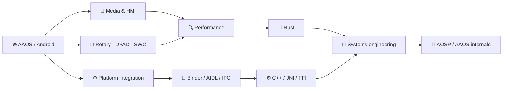

<p align="center">
  
</p>

<h1 align="center">👋 Adrian-Leontin Rusu</h1>

<h3 align="center">Senior Android / Android Automotive (AAOS) Engineer</h3>

<p align="center">
  
</p>

<p align="center">
  <strong>🚘 Automotive media & HMI · ⚡ Android performance · ⚙️ Platform & systems engineering</strong>
</p>

<p align="center">
  <a href="https://adrianrusu.dev">
    
  </a>
  <a href="https://www.linkedin.com/in/adrian-leontin-rusu/">
    
  </a>
  <a href="mailto:hello@adrianrusu.dev">
    
  </a>
</p>

<p align="center">
  <a href="https://skillicons.dev">
    
  </a>
</p>

> **Android at the surface. Systems underneath.**

---

## 🧭 Engineering snapshot

| 🚘 Production | 🔬 Under the UI | 🧪 Expanding into |
|---|---|---|
| Android Automotive / AAOS | Binder / AIDL / IPC | AOSP / AAOS internals |
| Media & HMI | Rendering, jank & startup | Modern C++ |
| Rotary / DPAD / SWC | Memory & ANR analysis | Rust |
| OEM integration / RRO | JNI / FFI | Linux systems engineering |

I build **Android Automotive media experiences** and spend a lot of time investigating the behavior beneath the UI: process boundaries, rendering, startup, memory, IPC, native integration and platform constraints.

---

## 🏗️ How the pieces connect



---

## 🚀 Featured engineering work

| | Project | Engineering focus | Deep dive |
|:---:|---|---|---|
| 🐼 | **[PandaWave](https://github.com/adrianrusu16/PandaWave)** | Android Automotive media platform · Compose · Media3 · Binder/AIDL · JNI/FFI · Rust | [Case study](https://adrianrusu.dev/projects/pandawave/) |
| 🌲 | **[Canopy](https://github.com/adrianrusu16/Canopy)** | Rust/Tonic media control plane · PostgreSQL · playback authorization · Nginx delivery | [Case study](https://adrianrusu.dev/projects/canopy/) |
| 📡 | **[canopy-api](https://github.com/adrianrusu16/canopy-api)** | Versioned Protobuf/gRPC contract · Buf · compatibility discipline | [Case study](https://adrianrusu.dev/projects/canopy-api/) |
| ⚙️ | **[C++ Mastery](https://github.com/adrianrusu16/cpp-mastery)** | Object lifetime · RAII · allocators · templates · custom containers · sanitizers | [Case study](https://adrianrusu.dev/projects/cpp-mastery/) |
| 🌐 | **[Engineering Portfolio](https://github.com/adrianrusu16/adrian-rusu-portfolio)** | Astro/TypeScript · technical case studies · structured data · SEO/AEO · testing | [adrianrusu.dev](https://adrianrusu.dev) |
| 🐧 | **[Panda Workstation](https://github.com/adrianrusu16/panda-workstation)** | Reproducible CachyOS workstation · Fish · chezmoi · Linux tooling · machine profiles | [Repository](https://github.com/adrianrusu16/panda-workstation) |

---

## 🎯 Current focus

| 🚘 Android Automotive | ⚡ Performance & diagnostics |
|---|---|
| AAOS media & HMI behavior<br>MediaSession / MediaBrowser / Media3<br>Rotary, focus & steering-wheel controls<br>UX restrictions & OEM-specific behavior<br>RRO and platform integration | Perfetto & ATrace<br>Android Studio Profiler<br>ANR analysis<br>Rendering & jank<br>Startup & memory behavior<br>adb / logcat / LeakCanary |

| ⚙️ Platform & systems | 🤖 AI-assisted engineering |
|---|---|
| Binder / AIDL / services / IPC<br>AOSP exploration<br>JNI / FFI<br>Modern C++<br>Rust | Claude Code<br>Codex<br>Repository exploration<br>Implementation support<br>Debugging & review workflows |

---

## 🧰 Technical toolbox

<details open>
<summary><b>📱 Android & Automotive</b></summary>

<br>

Kotlin · Java · Android SDK · AAOS · Media3 · MediaSession · MediaBrowser · Binder/AIDL · Services · RRO · Compose · XML · Custom Views · RecyclerView · RxJava · Dagger/Hilt · Gradle

</details>

<details>
<summary><b>⚙️ Systems & backend</b></summary>

<br>

Rust · C++ · C · JNI/FFI · gRPC · Protobuf · PostgreSQL · SQLx · Nginx · CMake · Linux

</details>

<details>
<summary><b>🛠️ Engineering workflow</b></summary>

<br>

Git · GitHub · GitHub Actions · Jenkins · testing · PR review · Claude Code · Codex

</details>

---

## 🧪 Current systems lab

**[Panda Workstation](https://github.com/adrianrusu16/panda-workstation)** is my reproducible Linux workstation project.

```text
CachyOS
   │
   ├── 🐚 Fish
   ├── 🏠 chezmoi
   ├── 📦 declarative package layers
   ├── 💻 machine-specific profiles
   ├── 🧪 Android / C++ / Rust / AOSP tooling
   └── 🎮 gaming + desktop configuration
```

The goal: turn a fresh Linux installation into a documented, reproducible engineering environment instead of rebuilding it from memory.

---

## 📊 GitHub activity

### 🧊 Contribution landscape

<p align="center">
  
</p>

### 👻 Pac-Man contribution graph

<picture>
  <source media="(prefers-color-scheme: dark)" srcset="https://raw.githubusercontent.com/adrianrusu16/adrianrusu16/output/pacman-contribution-graph-dark.svg" />
  <source media="(prefers-color-scheme: light)" srcset="https://raw.githubusercontent.com/adrianrusu16/adrianrusu16/output/pacman-contribution-graph.svg" />
  
</picture>

---

## 📝 Engineering notes

I publish shorter technical write-ups alongside project case studies.

[](https://adrianrusu.dev/notes/)

Topics include Android/AAOS engineering, platform behavior, performance, architecture and systems work.

---

## 🧭 Direction

```text
Android / AAOS
      │
      ▼
Platform engineering
      │
      ├────────► AOSP / AAOS internals
      │
      ├────────► C++ / native integration
      │
      └────────► Rust / systems engineering
```

I'm moving deeper into **Android Automotive platform engineering and systems engineering** while continuing to build production Android expertise.

---

<h2 align="center">🤝 Connect</h2>

<p align="center">
  <a href="https://adrianrusu.dev">
    
  </a>
  <a href="https://www.linkedin.com/in/adrian-leontin-rusu/">
    
  </a>
  <a href="mailto:hello@adrianrusu.dev">
    
  </a>
</p>

<p align="center">
  📍 Cluj-Napoca, Romania
</p>
