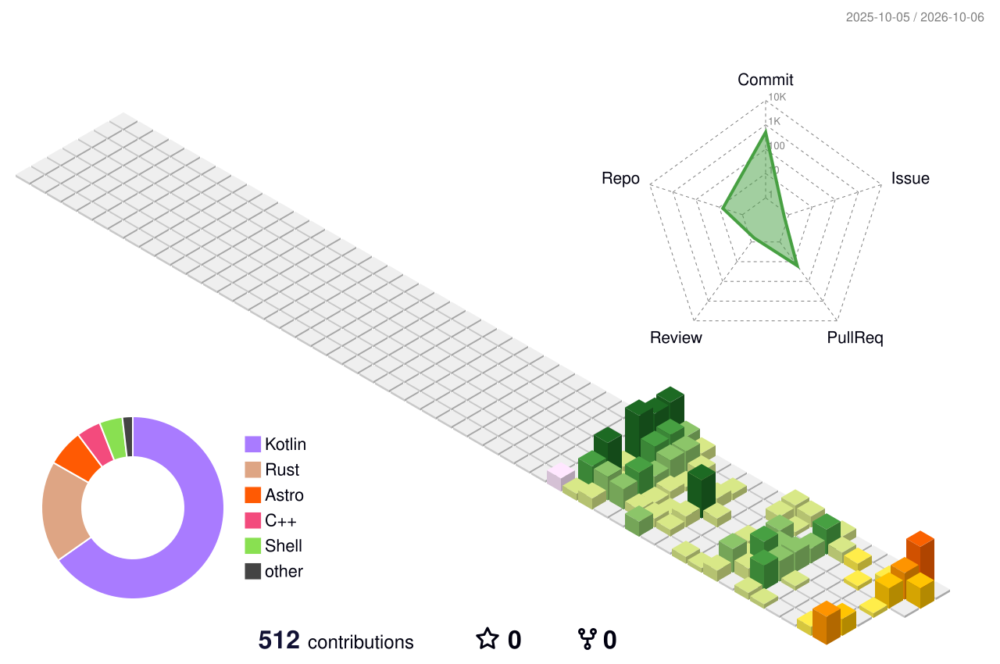

<div align="center">    # 👋 Adrian-Leontin Rusu  ### Senior Android / Android Automotive (AAOS) Engineer  **🚘 Automotive media & HMI · ⚡ Android performance · ⚙️ Platform & systems engineering**  [](https://adrianrusu.dev) [](https://www.linkedin.com/in/adrian-leontin-rusu/) [](mailto:hello@adrianrusu.dev)  <br/>  <a href="https://skillicons.dev">    </a>  > **Android at the surface. Systems underneath.**  </div>  ---  ## 🧭 Engineering snapshot  | 🚘 Production | 🔬 Under the UI | 🧪 Expanding into | |---|---|---| | Android Automotive / AAOS | Binder / AIDL / IPC | AOSP / AAOS internals | | Media & HMI | Rendering, jank & startup | Modern C++ | | Rotary / DPAD / SWC | Memory & ANR analysis | Rust | | OEM integration / RRO | JNI / FFI | Linux systems engineering |  I build **Android Automotive media experiences** and spend a lot of time investigating the behavior beneath the UI: process boundaries, rendering, startup, memory, IPC, native integration and platform constraints.  ---  ## 🏗️ How the pieces connect  ```mermaid flowchart LR     A["🚘 AAOS / Android"] --> B["🎵 Media & HMI"]     A --> C["🧭 Rotary · DPAD · SWC"]     A --> D["⚙️ Platform integration"]      B --> E["🔍 Performance"]     C --> E     D --> F["🔗 Binder / AIDL / IPC"]      E --> G["🦀 Rust"]     F --> H["⚙️ C++ / JNI / FFI"]      G --> I["🧪 Systems engineering"]     H --> I     I --> J["📱 AOSP / AAOS internals"] ```  ---  ## 🚀 Featured engineering work  | | Project | Engineering focus | Deep dive | |:---:|---|---|---| | 🐼 | **[PandaWave](https://github.com/adrianrusu16/PandaWave)** | Android Automotive media platform · Compose · Media3 · Binder/AIDL · JNI/FFI · Rust | [Case study](https://adrianrusu.dev/projects/pandawave/) | | 🌲 | **[Canopy](https://github.com/adrianrusu16/Canopy)** | Rust/Tonic media control plane · PostgreSQL · playback authorization · Nginx delivery | [Case study](https://adrianrusu.dev/projects/canopy/) | | 📡 | **[canopy-api](https://github.com/adrianrusu16/canopy-api)** | Versioned Protobuf/gRPC contract · Buf · compatibility discipline | [Case study](https://adrianrusu.dev/projects/canopy-api/) | | ⚙️ | **[C++ Mastery](https://github.com/adrianrusu16/cpp-mastery)** | Object lifetime · RAII · allocators · templates · custom containers · sanitizers | [Case study](https://adrianrusu.dev/projects/cpp-mastery/) | | 🌐 | **[Engineering Portfolio](https://github.com/adrianrusu16/adrian-rusu-portfolio)** | Astro/TypeScript · technical case studies · structured data · SEO/AEO · testing | [adrianrusu.dev](https://adrianrusu.dev) | | 🐧 | **[Panda Workstation](https://github.com/adrianrusu16/panda-workstation)** | Reproducible CachyOS workstation · Fish · chezmoi · Linux tooling · machine profiles | [Repository](https://github.com/adrianrusu16/panda-workstation) |  ---  ## 🎯 Current focus  <table> <tr> <td width="50%" valign="top">  ### 🚘 Android Automotive  - AAOS media & HMI behavior - MediaSession / MediaBrowser / Media3 - Rotary, focus & steering-wheel controls - UX restrictions & OEM-specific behavior - RRO and platform integration  </td> <td width="50%" valign="top">  ### ⚡ Performance & diagnostics  - Perfetto & ATrace - Android Studio Profiler - ANR analysis - Rendering & jank - Startup & memory behavior - adb / logcat / LeakCanary  </td> </tr> <tr> <td width="50%" valign="top">  ### ⚙️ Platform & systems  - Binder / AIDL / services / IPC - AOSP exploration - JNI / FFI - Modern C++ - Rust  </td> <td width="50%" valign="top">  ### 🤖 AI-assisted engineering  - Claude Code - Codex - Repository exploration - Implementation support - Debugging & review workflows  </td> </tr> </table>  ---  ## 🧰 Technical toolbox  <details open> <summary><b>📱 Android & Automotive</b></summary> <br/>  Kotlin · Java · Android SDK · AAOS · Media3 · MediaSession · MediaBrowser · Binder/AIDL · Services · RRO · Compose · XML · Custom Views · RecyclerView · RxJava · Dagger/Hilt · Gradle  </details>  <details> <summary><b>⚙️ Systems & backend</b></summary> <br/>  Rust · C++ · C · JNI/FFI · gRPC · Protobuf · PostgreSQL · SQLx · Nginx · CMake · Linux  </details>  <details> <summary><b>🛠️ Engineering workflow</b></summary> <br/>  Git · GitHub · GitHub Actions · Jenkins · testing · PR review · Claude Code · Codex  </details>  ---  ## 🧪 Current systems lab  **[Panda Workstation](https://github.com/adrianrusu16/panda-workstation)** is my reproducible Linux workstation project.  ```text CachyOS    │    ├── 🐚 Fish    ├── 🏠 chezmoi    ├── 📦 declarative package layers    ├── 💻 machine-specific profiles    ├── 🧪 Android / C++ / Rust / AOSP tooling    └── 🎮 gaming + desktop configuration ```  The goal: turn a fresh Linux installation into a documented, reproducible engineering environment instead of rebuilding it from memory.  ---  ## 📊 GitHub activity  ### 🧊 Contribution landscape  <p align="center">    </p>  ### 👻 Pac-Man contribution graph  <picture>   <source media="(prefers-color-scheme: dark)" srcset="https://raw.githubusercontent.com/adrianrusu16/adrianrusu16/output/pacman-contribution-graph-dark.svg" />   <source media="(prefers-color-scheme: light)" srcset="https://raw.githubusercontent.com/adrianrusu16/adrianrusu16/output/pacman-contribution-graph.svg" />    </picture>  ---  ## 📝 Engineering notes  I publish shorter technical write-ups alongside project case studies.  [](https://adrianrusu.dev/notes/)  Topics include Android/AAOS engineering, platform behavior, performance, architecture and systems work.  ---  ## 🧭 Direction  ```text Android / AAOS       │       ▼ Platform engineering       │       ├────────► AOSP / AAOS internals       │       ├────────► C++ / native integration       │       └────────► Rust / systems engineering ```  I'm moving deeper into **Android Automotive platform engineering and systems engineering** while continuing to build production Android expertise.  ---  <div align="center">  ## 🤝 Connect  [](https://adrianrusu.dev) [](https://www.linkedin.com/in/adrian-leontin-rusu/) [](mailto:hello@adrianrusu.dev)  📍 Cluj-Napoca, Romania  </div>
